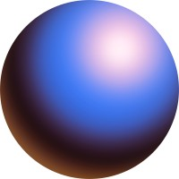

   

        <button id = "optimism-button" type="button" class="button-with-image text-white bg-gray-800 hover:bg-gray-900 focus:outline-none focus:ring-4 focus:ring-gray-300 font-medium rounded-lg text-sm px-5 py-2.5 mr-2 mb-2 dark:bg-gray-800 dark:hover:bg-gray-700 dark:focus:ring-gray-700 dark:border-gray-700">
            
            Optimism</button>
    
            <button id = "zora-button" type="button" class="button-with-image text-white bg-gray-800 hover:bg-gray-900 focus:outline-none focus:ring-4 focus:ring-gray-300 font-medium rounded-lg text-sm px-5 py-2.5 mr-2 mb-2 dark:bg-gray-800 dark:hover:bg-gray-700 dark:focus:ring-gray-700 dark:border-gray-700">
                
                Zora</button>

                <button id = "polygon-button" type="button" class="button-with-image text-white bg-gray-800 hover:bg-gray-900 focus:outline-none focus:ring-4 focus:ring-gray-300 font-medium rounded-lg text-sm px-5 py-2.5 mr-2 mb-2 dark:bg-gray-800 dark:hover:bg-gray-700 dark:focus:ring-gray-700 dark:border-gray-700">
                    
                    Polygon</button>

                    <button id = "mode-button" type="button" class="button-with-image text-white bg-gray-800 hover:bg-gray-900 focus:outline-none focus:ring-4 focus:ring-gray-300 font-medium rounded-lg text-sm px-5 py-2.5 mr-2 mb-2 dark:bg-gray-800 dark:hover:bg-gray-700 dark:focus:ring-gray-700 dark:border-gray-700">
                        
                        Mode</button>

                        <button id = "ethereum-button"type="button" class="button-with-image text-white bg-gray-800 hover:bg-gray-900 focus:outline-none focus:ring-4 focus:ring-gray-300 font-medium rounded-lg text-sm px-5 py-2.5 mr-2 mb-2 dark:bg-gray-800 dark:hover:bg-gray-700 dark:focus:ring-gray-700 dark:border-gray-700">
                            
                            Ethereum</button>

                            <button id = "base-button" type="button" class="button-with-image text-white bg-gray-800 hover:bg-gray-900 focus:outline-none focus:ring-4 focus:ring-gray-300 font-medium rounded-lg text-sm px-5 py-2.5 mr-2 mb-2 dark:bg-gray-800 dark:hover:bg-gray-700 dark:focus:ring-gray-700 dark:border-gray-700">
                                
                                Base</button>

    

    <label for="betting-condition" class="block mb-2 text-sm font-medium text-gray-900 dark:text-white">Select an option</label>
    <select id="betting-condition" class="bg-gray-50 border border-gray-300 text-gray-900 text-sm rounded-lg focus:ring-blue-500 focus:border-blue-500 block w-full p-2.5 dark:bg-gray-700 dark:border-gray-600 dark:placeholder-gray-400 dark:text-white dark:focus:ring-blue-500 dark:focus:border-blue-500">
      <option selected>Choose a betting condition...</option>
      <option value="nft-floor-price">NFT Floor Price</option>
      <option value="asset-price">Asset Price</option>
      <option value="ethereum-gas">Ethereum Gas</option>
      <option value="indexes">Indexes</option>
    </select>

    <label for="helper-text" class="block mb-2 text-sm font-medium text-gray-900 dark:text-white">Your email</label>
    <input type="text" id="helper-text" aria-describedby="helper-text-explanation" class="bg-gray-50 border border-gray-300 text-gray-900 text-sm rounded-lg focus:ring-blue-500 focus:border-blue-500 block w-full p-2.5  dark:bg-gray-700 dark:border-gray-600 dark:placeholder-gray-400 dark:text-white dark:focus:ring-blue-500 dark:focus:border-blue-500" placeholder="Threshold...">

<label for="helper-text" class="block mb-2 text-sm font-medium text-gray-900 dark:text-white">Your email</label>
<input type="text" id="helper-text" aria-describedby="helper-text-explanation" class="bg-gray-50 border border-gray-300 text-gray-900 text-sm rounded-lg focus:ring-blue-500 focus:border-blue-500 block w-full p-2.5  dark:bg-gray-700 dark:border-gray-600 dark:placeholder-gray-400 dark:text-white dark:focus:ring-blue-500 dark:focus:border-blue-500" placeholder="Date of Resolution">

 
    <button type="button" id = "deploy" class="text-white bg-gradient-to-br from-purple-600 to-blue-500 hover:bg-gradient-to-bl focus:ring-4 focus:outline-none focus:ring-blue-300 dark:focus:ring-blue-800 font-medium rounded-lg text-sm px-5 py-2.5 text-center mr-2 mb-2">Start Bet</button>
     
    <button type="button" id = "make-prediction-more" class="text-white bg-gradient-to-br from-purple-600 to-blue-500 hover:bg-gradient-to-bl focus:ring-4 focus:outline-none focus:ring-blue-300 dark:focus:ring-blue-800 font-medium rounded-lg text-sm px-5 py-2.5 text-center mr-2 mb-2">Make Prediction (More)</button>
    <button type="button" id = "make-prediction-less" class="text-white bg-gradient-to-br from-purple-600 to-blue-500 hover:bg-gradient-to-bl focus:ring-4 focus:outline-none focus:ring-blue-300 dark:focus:ring-blue-800 font-medium rounded-lg text-sm px-5 py-2.5 text-center mr-2 mb-2">Make Prediction (Less)</button>

    <label for="countries" class="block mb-2 text-sm font-medium text-gray-900 dark:text-white">Select an option</label>
    <select id="countries" class="bg-gray-50 border border-gray-300 text-gray-900 text-sm rounded-lg focus:ring-blue-500 focus:border-blue-500 block w-full p-2.5 dark:bg-gray-700 dark:border-gray-600 dark:placeholder-gray-400 dark:text-white dark:focus:ring-blue-500 dark:focus:border-blue-500">
      <option selected>Choose ERC20</option>
      <option value="US">NFT Floor Price</option>
      <option value="CA">Asset Price</option>
      <option value="FR">France</option>
      <option value="DE">Germany</option>
    </select>

    <button type="button" id = "deposit-erc20-openbet" class="text-white bg-gradient-to-br from-purple-600 to-blue-500 hover:bg-gradient-to-bl focus:ring-4 focus:outline-none focus:ring-blue-300 dark:focus:ring-blue-800 font-medium rounded-lg text-sm px-5 py-2.5 text-center mr-2 mb-2">Deposit ERC20</button>

 

    <select id="countries" class="bg-gray-50 border border-gray-300 text-gray-900 text-sm rounded-lg focus:ring-blue-500 focus:border-blue-500 block w-full p-2.5 dark:bg-gray-700 dark:border-gray-600 dark:placeholder-gray-400 dark:text-white dark:focus:ring-blue-500 dark:focus:border-blue-500">
      <option selected>Choose NFT</option>
      <option value="US">NFT Floor Price</option>
      <option value="CA">Asset Price</option>
      <option value="FR">France</option>
      <option value="DE">Germany</option>
    </select>

    <button type="button"id = "deposit-nft" class="text-white bg-gradient-to-br from-purple-600 to-blue-500 hover:bg-gradient-to-bl focus:ring-4 focus:outline-none focus:ring-blue-300 dark:focus:ring-blue-800 font-medium rounded-lg text-sm px-5 py-2.5 text-center mr-2 mb-2">Deposit NFT</button>

 
    <button type="button" id = "lock" class="text-white bg-gradient-to-r from-purple-500 to-pink-500 hover:bg-gradient-to-l focus:ring-4 focus:outline-none focus:ring-purple-200 dark:focus:ring-purple-800 font-medium rounded-lg text-sm px-5 py-2.5 text-center mr-2 mb-2">Lock</button>
 
<button type="button" class="text-white bg-blue-400 dark:bg-blue-500 cursor-not-allowed font-medium rounded-lg text-sm px-5 py-2.5 text-center" disabled>Accept</button>
 
<h1 id = "generated-address" style="color: white;">Your Generated Contract Address: </h1>

